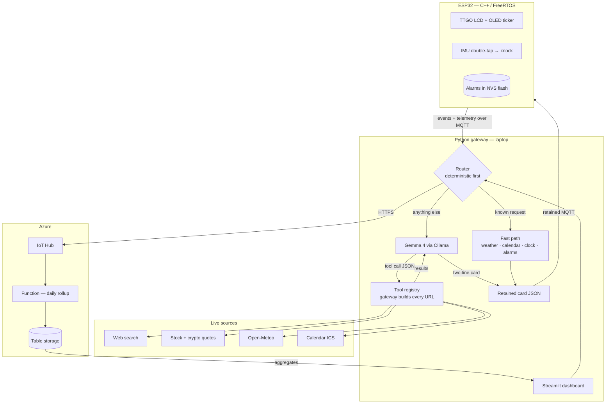

# Briefly

A private briefing station for your desk or nightstand. It shows the weather, your next calendar event, and any topic you name in plain English. Tell it you care about the Steelers and SpaceX stock and it works out where to look, in real time.

It is also a reliable alarm clock. Knock twice on the case to snooze. The clock and alarm keep working when the laptop is closed.


## Why

Checking the weather, your calendar, and the news takes ten seconds. Doing it on a phone takes ten minutes, because every unlock invites notifications and feeds. Smart displays solve this but introduce an always listening microphone and send every request to a vendor's cloud.

Briefly is the middle path. Glanceable information on dedicated hardware, personalized in plain English, with the language model running locally through Ollama. There is no microphone, no vendor account, and no cloud inference: the model reasoning about your day runs on hardware you own. When a topic needs current information the gateway makes an anonymous public API call, and nothing else leaves the network.

## Architecture

Three tiers. An ESP32 renders and reacts, a Python gateway thinks, and Azure stores and aggregates.



The device and gateway talk over MQTT through a local Mosquitto broker with username and password authentication. The gateway publishes retained card messages, so the device recovers its display automatically after either side restarts.

## How a card is built

1. A request arrives: a scheduled refresh, a knock on the case, or a line of chat.
2. The router checks the deterministic fast path first. Weather, calendar, clock, alarms, and a short table of common topics are handled entirely in code, with no model call.
3. Anything else goes to Gemma, which fetches nothing itself. It emits a structured tool call, a tool name and arguments, and the gateway validates both against a schema before executing.
4. Results return to Gemma, which condenses them into two lines of at most 21 characters and returns JSON constrained output.
5. The gateway publishes the card as a retained MQTT message. The device renders it across the color LCD and the OLED ticker. Cards refresh every 15 minutes or on demand.

Measured on an M4 MacBook Air with `gemma4:12b`: tool selection about 5 s, the lookup itself 1 to 3 s, card writing about 6 s. Tool selection is cached for an hour, so only the first refresh of a session pays for it.

## Design decisions

**The model chooses tools, never URLs.** Asked to add a topic, a language model will confidently produce a plausible feed URL that returns 404. An earlier version solved that by constraining the model to a fixed list of sources, which capped the product at whatever had been typed into that file. Tool calling keeps the safety property without the cap: Gemma emits a tool name and arguments, the gateway validates both and builds the request itself. New capability means adding a tool, not widening a whitelist.

**The language model is never in the path of a critical command.** Model output varies for identical input, so the commands people use most are handled deterministically in code. The word `update` is a hard coded trigger. Alarm phrases are matched by pattern first. Only free form text reaches the model. The feature that feels most intelligent needed the least model involvement.

**Facts the model cannot know are resolved in code.** Asked about "SpaceX stock", Gemma reached for a web search and reported a planned IPO, because its training data predates the listing. Ticker resolution now happens in a lookup table before the tool runs, so the same request returns a live quote. Where correctness depends on information newer than the weights, deterministic code owns it.

**Prompts have to be explicit about recency.** The first working version answered "Steelers" with the year the franchise was founded — technically responsive, useless as a brief. The card prompt now bans background facts by name and receives today's date. That single change was the difference between a demo and something worth glancing at.

**Reasoning models need their reasoning switched off.** `gemma4:12b` writes an internal monologue before answering, which is pure overhead when the output is a small JSON object, and it blew through the original timeouts. Calls now pass `think: false`, keep the weights resident with `keep_alive`, and cap output length.

**Every model path has a deterministic fallback.** Each call is bounded by a timeout and each result is parsed defensively. If Gemma is slow, absent, or returns something unparseable, the gateway formats the raw tool result itself and still publishes a card. The system degrades in quality rather than failing.

**The device degrades instead of breaking.** Alarms persist in on chip NVS flash and time comes from NTP, so the clock and alarm subsystem never depend on the gateway. Close the laptop and Briefly is still an alarm clock. Open it and retained MQTT messages restore the cards without user action.

**Firmware is organized as FreeRTOS tasks.** Networking, display, input, and timekeeping run as separate tasks so a slow network call cannot stall the display or delay an alarm.

**Transport, model, tools, and sources are separate modules.** Each can be exercised independently, which makes the whole gateway testable with no hardware attached. A virtual device in `tools/` speaks the same MQTT protocol as the firmware, so both halves of the team can work in parallel.

## Repository layout

```
firmware/          C++ / Arduino / PlatformIO. FreeRTOS tasks, display, alarm, NVS persistence.
gateway/
  service.py       Always on: refresh loop, MQTT wiring, Azure forwarding.
  app.py           Streamlit dashboard: cards, chat router, analytics, settings.
  brain.py         Tool-calling loop, card writing, preference parsing.
  tools.py         Tool registry, argument schemas, validation, ticker resolution.
  fetchers.py      Web search, quotes, weather, geocoding, calendar, RSS.
  catalog.py       Fast-path table for common topics.
  mqtt_link.py     Publish and subscribe, retained card handling.
  cloud.py         Azure IoT Hub forwarding.
tools/
  virtual_device.py   Full device simulator. No hardware required.
  publish_test_card.py
azure/             Azure Function for daily aggregates.
mosquitto/         Broker config.
```

## Running the gateway

Requirements: Python 3.11 or newer, a local Mosquitto broker, and [Ollama](https://ollama.com) with a Gemma model pulled.

Terminal 1, the broker:

```bash
cd mosquitto
mosquitto_passwd -c passwd stationuser     # invent a password, remember it
chmod 644 passwd                           # the broker drops privileges and must still read this
mosquitto -c mosquitto.conf -v
```

On macOS the server binary is not on PATH by default. If `mosquitto` is not found, use the full path Homebrew prints, typically `/opt/homebrew/opt/mosquitto/sbin/mosquitto`.

Terminal 2, the gateway service:

```bash
cd gateway
python3 -m venv .venv && source .venv/bin/activate
pip install -r requirements.txt
cp secrets.example.json secrets.json       # then set mqtt_pass to the password above
python3 service.py
```

Terminal 3, the dashboard:

```bash
cd gateway && source .venv/bin/activate
streamlit run app.py
```

The dashboard opens at `http://localhost:8501`. Add interests one at a time in Settings, or type `update` in the chat to refresh everything.

For the local model:

```bash
ollama pull gemma4:12b     # or gemma3:4b if you want speed over quality
ollama list                # confirm the exact tag
```

Paste that tag into Settings, enable Gemma, and save. Weather, calendar, alarms, and fast-path topics all work without it.

Every new terminal needs `source .venv/bin/activate` first. A missing `(.venv)` prefix on the prompt is the cause of almost every `ModuleNotFoundError` in this project.

## Running without hardware

`tools/virtual_device.py` speaks the same MQTT protocol as the firmware and draws both screens as ASCII.

```bash
source gateway/.venv/bin/activate
python3 tools/virtual_device.py
```

Commands: `knock`, `update`, `next`, `dismiss`, `ring`, `temp`, `quit`.

## For the hardware half

Everything below runs independently of the gateway. The firmware never needs another machine to be useful, so you can complete all of it before any integration happens.

### 1. Wire it up

All four I2C parts share one two-wire bus plus 3.3 V and ground. **3.3 V only — never wire a sensor to 5 V.** Common ground everywhere. Suggested pins are in `firmware/include/config.h`; check them against the pinout card that shipped with the board before trusting them.

| Part | Bus / pin | Address |
| --- | --- | --- |
| SSD1306 OLED | I2C | `0x3C` |
| CAP1188 touch | I2C | `0x29` or `0x28` |
| LSM6DSO IMU | I2C + INT1 → GPIO 32 | `0x6B` or `0x6A` |
| DHT20 | I2C | `0x38` |
| Buzzer | GPIO 25 | — |
| Status LED | GPIO 26, through ~220 Ω | — |

SDA is GPIO 21, SCL is GPIO 22. The CAP1188 and LSM6DSO breakouts need their header strips soldered on; the DHT20 module plugs straight into the breadboard.

### 2. Flash it

```bash
cp firmware/include/secrets_example.h firmware/include/secrets.h
```

Fill in four values in `secrets.h`:

- `WIFI_SSID` / `WIFI_PASS` — **use a phone hotspot.** Campus WPA2-Enterprise (eduroam) does not work with this ESP32 and is not worth fighting.
- `MQTT_HOST` — the IP of the laptop running the broker, on that same hotspot. Find it with `ipconfig getifaddr en0` on macOS or `ipconfig` on Windows. This is not `127.0.0.1`; that address means "this device" and the ESP32 would be looking at itself.
- `MQTT_USER` / `MQTT_PASSWD` — whatever was set with `mosquitto_passwd`.

Then open the `firmware/` folder in VS Code with the PlatformIO extension and press Upload, then Monitor at 115200 baud. If no serial port appears, install the USB driver named on the board's product page (CP210x or CH340) and try a data cable rather than a charge-only one.

### 3. Read the boot log

This is the milestone. The firmware probes every peripheral and prints a roll call:

```
=== Briefing Station boot ===
[BOOT] OLED  0x3C  [OK]
[BOOT] CAP1188      [OK]
[BOOT] DHT20 0x38   [OK]
[BOOT] LSM6DSO knock[OK]
[WIFI] connected, ip 172.20.10.4
[MQTT] connected
```

Any `[--]` means that part was not found on the bus — usually a wiring or address problem, and everything else keeps working, so bring the hardware up in stages rather than all at once. The color LCD should show an NTP-synced clock even with nothing else attached.

### 4. Check the interactions

| Action | Expected |
| --- | --- |
| Button A (GPIO 0), short press | serial logs an update request |
| Button B (GPIO 35), short press | cycles to the next card |
| Hold either button ~1.2 s | dismisses a ringing alarm |
| Touch pad 1 / pad 2 | next card / request update |
| **Double-knock the case** | serial logs `[KNOCK] double-tap` |

The knock is the one worth tuning. If it fires from a light desk bump or refuses to fire at all, the thresholds are three register writes in `imuInitDoubleTap()` in `main.cpp` — registers `0x57`, `0x58`, `0x59`, where higher values mean less sensitive.

To test an alarm without waiting for morning, set one a minute ahead from the dashboard, or publish directly:

```bash
mosquitto_pub -h <broker-ip> -u stationuser -P <password> \
  -t station/command -m '{"type":"set_alarm","time":"07:00","days":[0,1,2,3,4,5,6]}'
```

### 5. Run the whole stack yourself

The repository is built so each of us can run a complete system independently — same code, separate broker and gateway. Clone it, then follow "Running the gateway" above with your own `secrets.json`. `secrets.json` and `secrets.h` are gitignored, so they never collide.

The only thing that has to happen in the same room is the final demo, where a physical device and a live dashboard need to appear in one video.

## MQTT topics

Watch everything with `mosquitto_sub -h localhost -u stationuser -P <password> -t '#' -v`.

| topic | direction | payload |
|---|---|---|
| `station/cards` | gateway → device (retained) | `{"v":1,"cards":[{"id","title","line1","line2"}]}` |
| `station/command` | gateway → device | `set_alarm` / `clear_alarms` / `beep` |
| `station/event` | device → gateway | `boot` / `knock` / `key` / `alarm` actions |
| `station/telemetry` | device → gateway | `{"tempF":71.2,"rh":48}` |
| `gateway/control` | dashboard → service | `refresh` / `temp_card` / `clear_temp` |

## Hardware

| Component | Qty |
| --- | --- |
| LILYGO TTGO ESP32 with built in LCD | 1 |
| SSD1306 OLED 128x64 | 1 |
| CAP1188 capacitive touch breakout | 1 |
| LSM6DSO accelerometer and gyroscope | 1 |
| DHT20 temperature and humidity sensor | 1 |
| Piezo buzzer | 1 |
| LEDs with resistors | 3 |
| Pushbuttons | 2 |
| Breadboard, jumper wires, headers | 1 |

A host laptop runs the gateway and the local model.

## Troubleshooting

| Symptom | Fix |
| --- | --- |
| `ModuleNotFoundError` | the terminal is not in the venv; `source .venv/bin/activate` |
| Broker: `Unable to open pwfile` | it drops privileges after start; `chmod 644 passwd` |
| `mosquitto: command not found` | use the full path, `/opt/homebrew/opt/mosquitto/sbin/mosquitto` |
| `[MQTT] connect failed rc=-2` | wrong `MQTT_HOST`, broker not running, or Mosquitto still bound to localhost |
| Device connects but no cards | is `service.py` running? check `mosquitto_sub -t station/cards -v` |
| Wi-Fi never connects | eduroam; use a phone hotspot |
| Gemma calls time out | raise `timeout_s` in `config.json`, or switch to a smaller model tag |
| Cards read like an encyclopedia | the recency rules in `SYS_CARD` were edited out |
| pip dependency conflict | never install `azure-iot-device`; it pins paho-mqtt to 1.x and the gateway needs 2.x |

## Status

- [x] Gateway end to end: live sources, retained cards, dashboard, virtual device.
- [x] Tool calling against a local Gemma 4 instance, with validation and fallbacks.
- [x] Hardware bring up: I2C roll call, both displays, NTP clock. *(firmware written, awaiting on-device verification)*
- [ ] Standalone alarm with double knock snooze on real hardware.
- [ ] Azure ingestion and the analytics dashboard.
- [ ] Enclosure and final demo.

Planned evaluation: the fraction of well formed cards Gemma produces across a week of real use, and a comparison of card quality and latency between the 4B and 12B model sizes.

## Contributions

This is a two person project. Bala is the team lead and wrote all of the software: the firmware, the gateway, the tool calling layer, the MQTT transport, and the dashboard. Justin handles hardware assembly and on device testing.

## License

<!-- TODO: pick one. MIT is the usual default. -->
